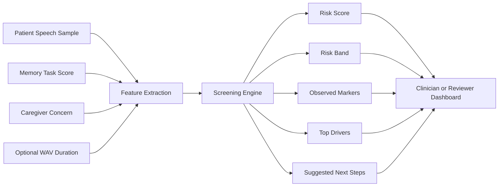
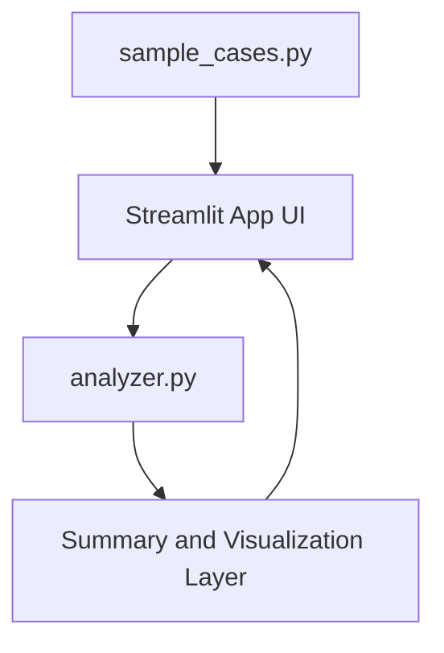
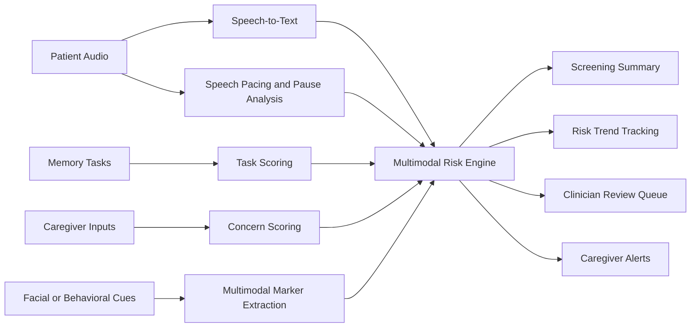

# CogniScan

CogniScan is a Streamlit prototype for the Nakshatra problem statement:
`HC-02: AI-Based Early Cognitive Decline Detection System`.

The current build focuses on one clear Round 1 workflow:

- load or enter a short patient speech sample
- add memory-task score and caregiver concern
- generate an explainable screening summary
- compare the result against a small sample cohort

## Project Structure

- `app.py`
  Main Streamlit application
- `src/analyzer.py`
  Screening logic and scoring helpers
- `src/sample_cases.py`
  Demo patient cases used in the UI
- `docs/architecture.md`
  High-level product and system explanation
- `docs/team-guide.md`
  Setup and run guide for teammates

## Quick Start

```powershell
pip install -r requirements.txt
streamlit run app.py
```

## Current Demo Flow

1. Load `Ramesh Patil` from the sample selector.
2. Run the screening.
3. Show the risk score, risk band, observed markers, and next steps.
4. Use the cohort section to compare low, moderate, and high-risk cases.

## Architecture Overview



## Prototype Component View



## Future-State Architecture



## Note

This prototype should be presented as a screening-support system for early review, not as a medical diagnosis tool.
