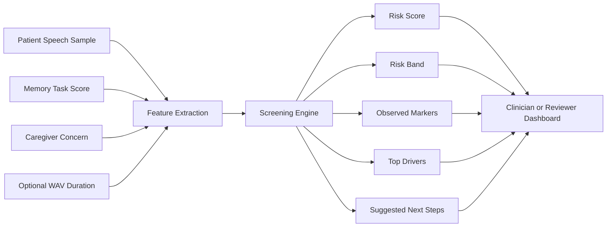
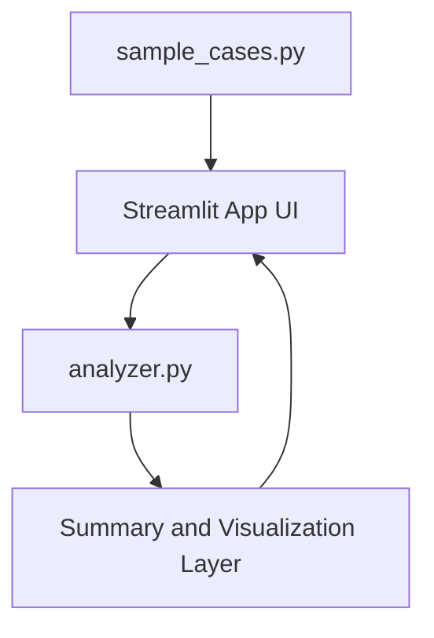
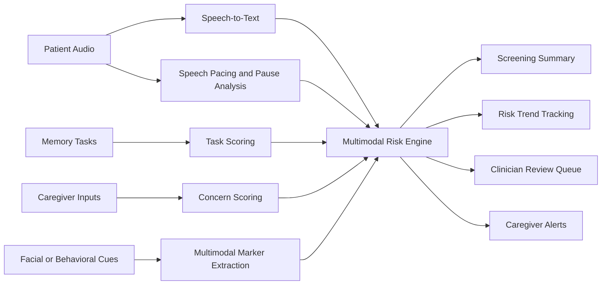

# CogniScan Architecture

## Product thesis

CogniScan is a speech-first cognitive screening suite intended for low-resource environments where specialist access is limited and early warning signals are often missed.

## Core workflow

1. The patient speaks in response to a prompt or guided memory task.
2. A caregiver or clinician enters quick structured observations.
3. The system extracts interpretable markers from transcript and pacing signals.
4. The risk engine produces a triage score and recommendation.
5. The clinician decides whether to monitor, rescreen, or escalate.

## Mermaid Architecture

## Prototype Component View

## Current prototype modules

- Screening Studio  
  Single-patient triage workflow
- Explainability Layer  
  Visible drivers behind the generated score
- Cohort View  
  Demo patient comparison for the presentation
- Summary Layer  
  Risk band, markers, next steps, and feature breakdown

## Signals used in the current MVP

- patient age
- memory task score
- caregiver concern level
- hesitation ratio
- confusion phrase count
- repetition ratio
- lexical diversity
- sentence compactness
- optional speaking-rate estimate from WAV duration

## Expansion roadmap

### Phase 2

- automatic transcription using Whisper
- guided verbal cognitive tasks
- facial-expression and fatigue markers
- multilingual support

### Phase 3

- longitudinal patient history
- clinician dashboard with repeat visit trends
- caregiver notifications
- intervention recommendations

## Future-State Architecture

## Deployment model

- frontline clinics
- mobile screening camps
- home-care providers
- telehealth follow-up workflows

## Why the architecture is strong for a hackathon

- one module works now
- future expansion is believable
- no heavy hardware dependency in Round 1
- product story is aligned with healthcare impact
